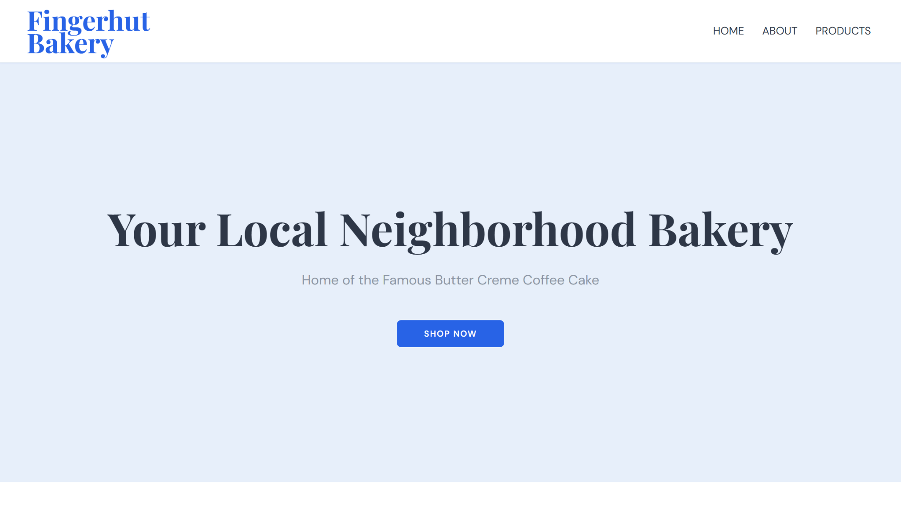
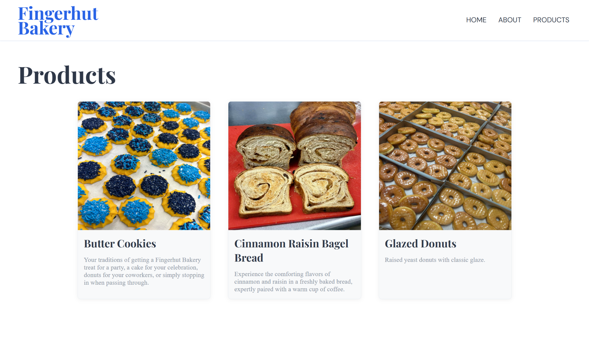

# odin-restaurant

# Fingerhut Bakery 🥐

A multi-page restaurant website built with **vanilla JavaScript** as part of **The Odin Project – JavaScript Course**.  
All page content is dynamically rendered using JavaScript and organized with ES6 modules and Webpack.

## 🌐 Live Preview
https://rfingerhut.github.io/odin-restaurant/

## 📸 Screenshots

### Home Page


### Products Page


> Screenshots showcase tab-based navigation and dynamically generated content.

## ✨ Features

- Fully dynamic page rendering using JavaScript
- Tabbed navigation (Home, About, Products) without page reloads
- Modular code structure for maintainability
- Styled with custom CSS
- Asset handling for images and fonts via Webpack

## 🧠 What I Learned

- DOM manipulation without hard-coded HTML content
- Structuring projects with ES6 modules
- Using Webpack to bundle JavaScript, CSS, images, and fonts
- Managing assets and project dependencies with npm
- Implementing tab-switching logic with event listeners

## 🛠️ Built With

- JavaScript (ES6)
- Webpack
- HTML
- CSS
- npm

## 📂 File Structure

odin-restaurant/
├── src/
│ ├── components/
│ │ ├── home.js
│ │ ├── about.js
│ │ └── products.js
│ ├── fonts/
│ ├── images/
│ ├── index.js
│ ├── styles.css
│ └── template.html
├── .gitignore
├── package.json
├── package-lock.json
├── webpack.config.js
└── README.md


> `node_modules` and `dist` are excluded via `.gitignore`.

## 🚀 Getting Started

### Prerequisites
- Node.js
- npm

### Installation

1. Clone the repository:
   ```bash
   git clone https://github.com/rfingerhut/odin-restaurant.git
   cd odin-restaurant

2. Install dependencies:
   ```bash
   npm install

3. Start the development server:
   ```bash
   npx webpack serve

4. Open your browser and navigate to:
   ```bash
   http://localhost:8080

## ⚙️ How It Works
- template.html contains a minimal HTML skeleton:
    - Header with navigation buttons
    - Empty <div id="content">
- Each tab (Home, About, Products) is defined in its own module inside src/components
- Clicking a navigation button:
    - Clears the current content
    - Calls the corresponding module to render new content
- All DOM elements are created and appended using JavaScript

## 📚 Assignment

This project is based on the Restaurant Page assignment from
[The Odin Project – JavaScript Course](https://www.theodinproject.com/)

Created as part of my web development learning journey 🚀
